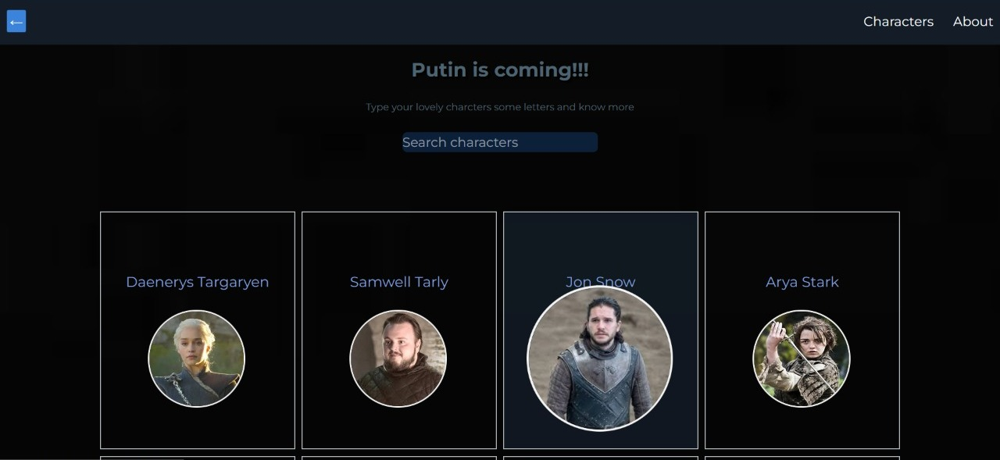
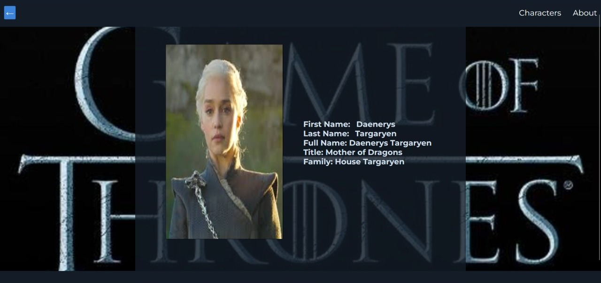
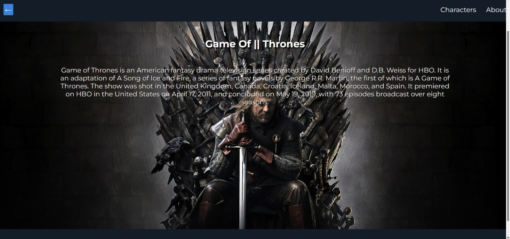

# 📖 [Game Of Thrones] 

  
  
  

> Describe your project in 1 or 2 sentences.

<h2 align="center"> Game of Thrones</h2> 
<h4 align="center"> Simple Page Application created with React and Redux and uses an Game of thrones API displays characters and more details of that characters.</h4>

## 🛠 Built With 

### Tech Stack 

> Describe the tech stack and include only the relevant sections that apply to your project.

  
Language

  <ul>
    <li><a href="https://reactjs.org/">React.js</a></li>
  </ul>

  
Storage

  <ul>
    <li><a href="https://expressjs.com/">Redux.js</a></li>
  </ul>

Database

  <ul>
    <li><a href="https://www.postgresql.org/">PostgreSQL</a></li>
  </ul>

<!-- Features -->

### Key Features 

> Describe between 1-3 key features of the application.

- **[key_feature_1]**
- **[key_feature_2]**
- **[key_feature_3]**

(<a href="#readme-top">back to top</a>)

<!-- LIVE DEMO -->

## 🚀 Live Demo 

> Add a link to your deployed project.

- [Live Demo Link](https://game-of-thrones-iota.vercel.app/)

- [Explanation video](https://www.loom.com/share/b9afc80c2a7c47ec82b2193ae078ec9b)

(<a href="#readme-top">back to top</a>)

<!-- GETTING STARTED -->

## 💻 Getting Started 

> Describe how a new developer could make use of your project.

To get a local copy up and running, follow these steps.

### Prerequisites

In order to run this project you need:

To have installed node.js and Git

### Setup

Clone this repository to your desired folder:

- First enter the folder you want to save the project.
  `cd my-folder`

- After moving into the directory you want to save the project you could clone it using the terminal.
  ` git clone https://github.com/NurkaAmre/Game_of_thrones`

### Install

Install this project with:

` cd Game-of-thrones`
`npm install`

### Usage

To run the project, execute the following command:

` npm start`

### Run tests

To run tests, run the following command:

`npm run test`

(<a href="#readme-top">back to top</a>)

<!-- AUTHORS -->

## 👥 Authors 

> Mention all of the collaborators of this project.

👤 **Nurgul**

- GitHub: [@githubhandle](https://github.com/NurkaAmre)
- Twitter: [@twitterhandle](https://twitter.com/AmreNurgul)
- LinkedIn: [LinkedIn](https://www.linkedin.com/in/amre-nurgul/)

(<a href="#readme-top">back to top</a>)

<!-- FUTURE FEATURES -->

## 🔭 Future Features 

> Describe 1 - 3 features you will add to the project.

- [ ] **[Improve styling]**
- [ ] **[Add seasons]**
- [ ] **[Add more functionalyties]**

(<a href="#readme-top">back to top</a>)

<!-- CONTRIBUTING -->

## 🤝 Contributing 

Contributions, issues, and feature requests are welcome!

Feel free to check the [issues page](../../issues/).

(<a href="#readme-top">back to top</a>)

<!-- SUPPORT -->

## ⭐️ Show your support 

> Write a message to encourage readers to support your project

If you like this project...

(<a href="#readme-top">back to top</a>)

<!-- ACKNOWLEDGEMENTS -->

## 🙏 Acknowledgments 

> Give credit to everyone who inspired your codebase.

I would like to thank [https://thronesapi.com/swagger/index.html?urls.primaryName=Game%20of%20Thrones%20API%20v2] and my best friend for Oscar!

(<a href="#readme-top">back to top</a>)

<!-- FAQ (optional) -->

## ❓ FAQ 

> Add at least 2 questions new developers would ask when they decide to use your project.

- **[Can I add more styling]**

  - [Yes you can]

- **[Can I add more rockets ?]**

  - [No U need to talk with API]

(<a href="#readme-top">back to top</a>)

<!-- LICENSE -->

## 📝 License 

This project is [MIT](./LICENSE) licensed.

_NOTE: we recommend using the [MIT license](https://choosealicense.com/licenses/mit/) - you can set it up quickly by [using templates available on GitHub](https://docs.github.com/en/communities/setting-up-your-project-for-healthy-contributions/adding-a-license-to-a-repository). You can also use [any other license](https://choosealicense.com/licenses/) if you wish._

(<a href="#readme-top">back to top</a>)

